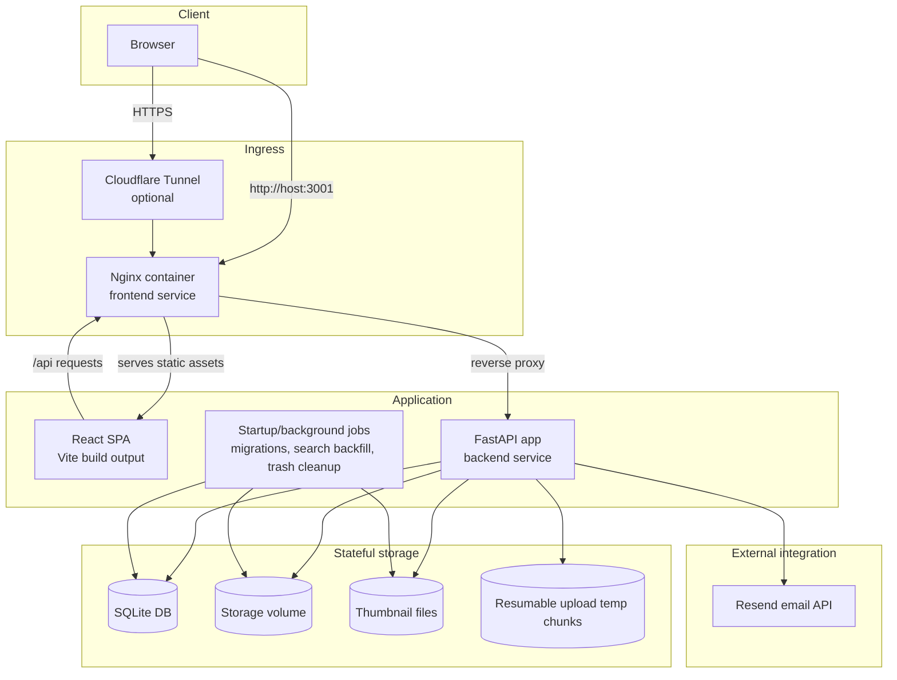
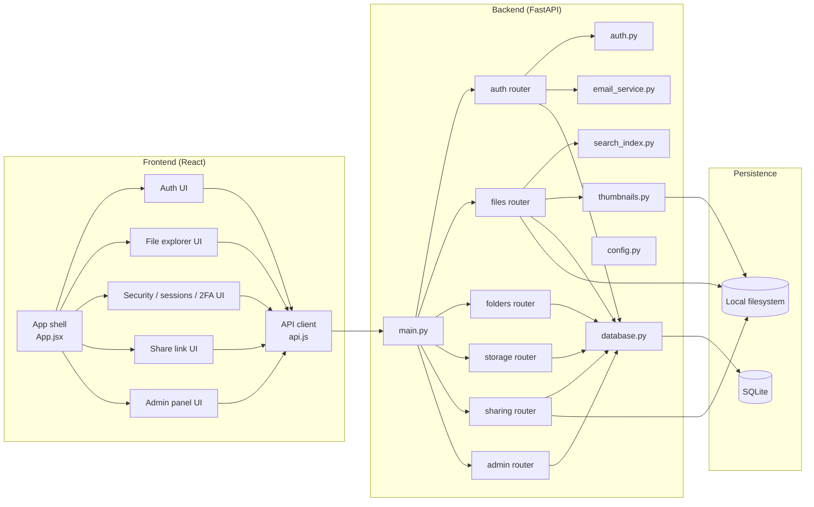
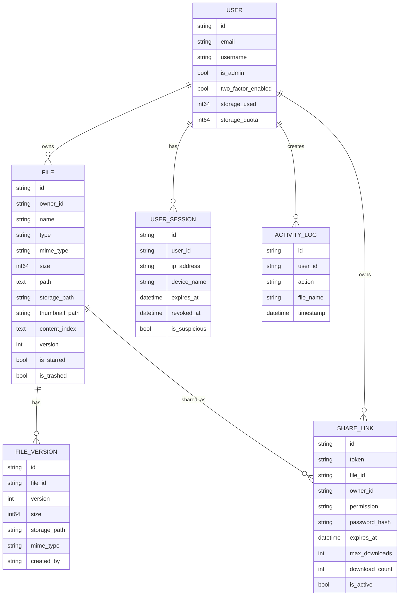
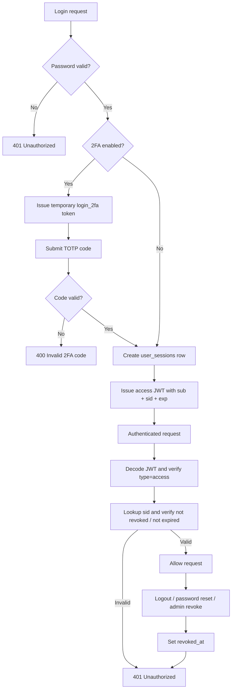
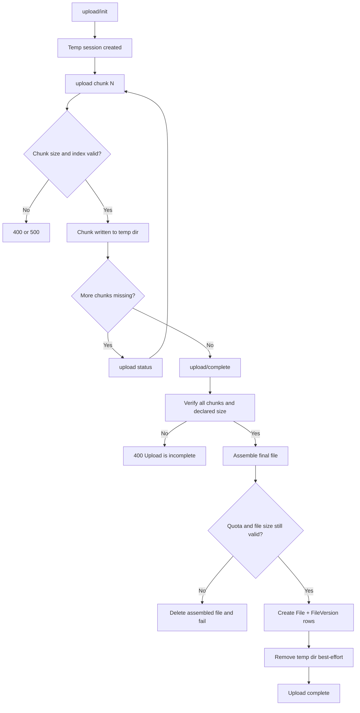

# Architecture

This document summarizes the runtime architecture implemented in the repository.
It is based on the code in [src](/D:/New%20folder/rs/src), [backend/app](/D:/New%20folder/rs/backend/app), [docker-compose.yml](/D:/New%20folder/rs/docker-compose.yml), and [nginx.conf](/D:/New%20folder/rs/nginx.conf).

## Table of Contents

- [1. Deployment Architecture](#1-deployment-architecture)
- [2. Logical Application Architecture](#2-logical-application-architecture)
- [3. Major Backend Responsibilities](#3-major-backend-responsibilities)
- [4. Data Model and Concurrency](#4-data-model-and-concurrency)
- [5. Key Runtime Flows](#5-key-runtime-flows)
- [6. Security Model](#6-security-model)
- [7. Error Handling and Fallbacks](#7-error-handling-and-fallbacks)
- [8. Performance Characteristics](#8-performance-characteristics)
- [9. Versioning Strategy](#9-versioning-strategy)
- [10. Startup and Maintenance Behavior](#10-startup-and-maintenance-behavior)
- [11. Recovery Procedures](#11-recovery-procedures)
- [12. Monitoring Points](#12-monitoring-points)
- [13. Known Limitations](#13-known-limitations)
- [14. Deployment Notes](#14-deployment-notes)
- [15. Minimum Diagram Inputs](#15-minimum-diagram-inputs)

## 1. Deployment Architecture

## 2. Logical Application Architecture

Frontend code entry points:

- [src/App.jsx](/D:/New%20folder/rs/src/App.jsx)
- [src/api.js](/D:/New%20folder/rs/src/api.js)
- [src/components/AuthPage.jsx](/D:/New%20folder/rs/src/components/AuthPage.jsx)
- [src/components/SecurityModal.jsx](/D:/New%20folder/rs/src/components/SecurityModal.jsx)
- [src/components/ShareModal.jsx](/D:/New%20folder/rs/src/components/ShareModal.jsx)
- [src/components/AdminPanel.jsx](/D:/New%20folder/rs/src/components/AdminPanel.jsx)

Backend code entry points:

- [backend/app/main.py](/D:/New%20folder/rs/backend/app/main.py)
- [backend/app/auth.py](/D:/New%20folder/rs/backend/app/auth.py)
- [backend/app/database.py](/D:/New%20folder/rs/backend/app/database.py)
- [backend/app/config.py](/D:/New%20folder/rs/backend/app/config.py)
- [backend/app/models.py](/D:/New%20folder/rs/backend/app/models.py)
- [backend/app/search_index.py](/D:/New%20folder/rs/backend/app/search_index.py)
- [backend/app/thumbnails.py](/D:/New%20folder/rs/backend/app/thumbnails.py)
- [backend/app/email_service.py](/D:/New%20folder/rs/backend/app/email_service.py)
- [backend/app/limiter.py](/D:/New%20folder/rs/backend/app/limiter.py)
- [backend/app/routers/auth.py](/D:/New%20folder/rs/backend/app/routers/auth.py)
- [backend/app/routers/files.py](/D:/New%20folder/rs/backend/app/routers/files.py)
- [backend/app/routers/folders.py](/D:/New%20folder/rs/backend/app/routers/folders.py)
- [backend/app/routers/storage.py](/D:/New%20folder/rs/backend/app/routers/storage.py)
- [backend/app/routers/sharing.py](/D:/New%20folder/rs/backend/app/routers/sharing.py)
- [backend/app/routers/admin.py](/D:/New%20folder/rs/backend/app/routers/admin.py)

## 3. Major Backend Responsibilities

- [backend/app/main.py](/D:/New%20folder/rs/backend/app/main.py): bootstraps FastAPI, applies CORS and SlowAPI middleware, registers routers, exposes loopback-only `/health`, creates directories, initializes the database, runs startup migrations, launches search-index backfill, and cleans up aged trash on startup.
- [backend/app/auth.py](/D:/New%20folder/rs/backend/app/auth.py): hashes and verifies passwords, signs and validates JWTs, creates password reset and temporary 2FA tokens, validates tracked sessions, throttles `last_seen_at` writes, and enforces the admin guard.
- [backend/app/routers/auth.py](/D:/New%20folder/rs/backend/app/routers/auth.py): handles registration, login, 2FA setup and verification, session listing and revocation, logout, password change, forgot-password, and reset-password. Recovery behavior includes returning a clear `503` when password-reset email delivery is not configured and revoking sessions when passwords change.
- [backend/app/routers/files.py](/D:/New%20folder/rs/backend/app/routers/files.py): handles directory listing, search, streamed upload, resumable chunk upload, preview, thumbnail serving, version history, rename, move, star, trash, restore, permanent delete, and copy. Recovery behavior includes removing partially written files on failed uploads, rejecting incomplete chunk assemblies, re-checking quota at upload completion, and retrying version-number conflicts up to five times before returning `409`.
- [backend/app/routers/folders.py](/D:/New%20folder/rs/backend/app/routers/folders.py): creates folders, enforces same-location uniqueness, and recursively trashes folder contents.
- [backend/app/routers/storage.py](/D:/New%20folder/rs/backend/app/routers/storage.py): reports per-user usage, version-aware storage breakdown, activity history, and empties the current user's trash.
- [backend/app/routers/sharing.py](/D:/New%20folder/rs/backend/app/routers/sharing.py): creates, lists, validates, and revokes share links. Recovery behavior includes expiry checks, download-limit checks, atomic download-slot reservation, password validation, and safe refusal when the file is missing or the link was revoked.
- [backend/app/routers/admin.py](/D:/New%20folder/rs/backend/app/routers/admin.py): manages users, quotas, admin status, forced password resets, user deletion, and system stats. Guard behavior is enforced centrally via `get_admin_user`.
- [backend/app/search_index.py](/D:/New%20folder/rs/backend/app/search_index.py): extracts bounded text content for indexing and produces short match snippets for search results.
- [backend/app/thumbnails.py](/D:/New%20folder/rs/backend/app/thumbnails.py): generates JPEG thumbnails for supported image formats and intentionally returns `None` instead of failing the upload when thumbnail generation breaks.
- [backend/app/email_service.py](/D:/New%20folder/rs/backend/app/email_service.py): sends password-reset and login-alert emails through Resend and raises explicit runtime errors on network or provider failures.

## 4. Data Model and Concurrency

Concurrency and transaction notes:

- Database access is request-scoped through [backend/app/database.py](/D:/New%20folder/rs/backend/app/database.py), which opens an async session per request and commits or rolls back at the end of the request.
- No custom SQLite isolation level is configured in code. The app relies on SQLAlchemy defaults and SQLite's normal locking behavior, so there is no extra transaction-isolation layer documented beyond that.
- File version creation uses a unique constraint on `(file_id, version)` plus `db.begin_nested()` retry loops in [backend/app/routers/files.py](/D:/New%20folder/rs/backend/app/routers/files.py) to mitigate concurrent version uploads/restores.
- Concurrent upload/delete operations are not globally serialized. Ownership checks prevent cross-user interference, but same-user concurrent operations can still race at the business-logic level.
- Upload sessions are namespaced by `user_id` and `upload_id`, which reduces collision risk for resumable uploads.
- There is no optimistic-lock version column on the main `files` row for rename/move/star updates. In practice this means "last successful write wins" for overlapping metadata updates.
- Trash and permanent delete authorization is ownership-based. Destructive queries always scope by `FileModel.id == file_id` and `FileModel.owner_id == current_user.id`, so one user cannot delete another user's rows through normal endpoints.

## 5. Key Runtime Flows

### Authentication and session management

1. React auth screens in [src/components/AuthPage.jsx](/D:/New%20folder/rs/src/components/AuthPage.jsx) call [src/api.js](/D:/New%20folder/rs/src/api.js).
2. `POST /api/auth/login` validates the user in [backend/app/routers/auth.py](/D:/New%20folder/rs/backend/app/routers/auth.py).
3. If 2FA is enabled, the backend returns a temporary token instead of a session JWT.
4. `POST /api/auth/login/2fa` exchanges that temporary token plus TOTP code for an access token.
5. The backend creates a `user_sessions` row and stores the session id in the JWT `sid` claim.
6. Authenticated requests send `Authorization: Bearer <token>`.
7. [backend/app/auth.py](/D:/New%20folder/rs/backend/app/auth.py) validates token signature, token type, user existence, session existence, session expiry, and revoked state.

JWT/session lifecycle:

### File upload and organization

1. The SPA uploads through [src/api.js](/D:/New%20folder/rs/src/api.js).
2. Small or non-resumable uploads go to `POST /api/files/upload`.
3. Resumable uploads use `POST /api/files/upload/init`.
4. Chunks are sent with `POST /api/files/upload/{upload_id}/chunk`.
5. Resume state is queried with `GET /api/files/upload/{upload_id}/status`.
6. Final assembly is triggered with `POST /api/files/upload/complete`.
7. Chunks are stored in `storage/tmp/<user_id>/<upload_id>`.
8. Completed files are assembled into the user's storage directory.
9. Metadata is persisted in SQLite, and an initial `FILE_VERSION` row is also created.
10. Thumbnail generation runs inline if the extension is thumbnail-capable.
11. Text indexing also runs inline for direct uploads and version uploads.

Resumable upload state machine:

### Search and text extraction

1. The frontend calls `GET /api/files/search?q=...`.
2. The backend searches file name, path, mime type, type, and `content_index`.
3. [backend/app/search_index.py](/D:/New%20folder/rs/backend/app/search_index.py) indexes only text-like content, not PDFs or `.docx` files.
4. Indexing is triggered when `file.type == "text"`.
5. Indexing is also triggered when `mime_type` starts with `text/`.
6. Indexing is also triggered when the extension is in the allowlist: `txt`, `md`, `markdown`, `json`, `xml`, `html`, `htm`, `css`, `js`, `jsx`, `ts`, `tsx`, `py`, `java`, `cpp`, `c`, `h`, `hpp`, `csv`, `log`, `yaml`, `yml`, `ini`, `toml`, `env`, `sql`.
7. Text extraction reads at most `256 * 1024` bytes per file, so the indexable payload is capped at 256 KB.
8. If extraction fails or the file is unsupported, `build_search_document()` returns `None`.
9. During startup backfill, `None` becomes `""` so the row is marked as checked and skipped on later backfills.
10. Practical result: plain text and common source/config files are indexed; PDFs, Office documents, images, and videos are searchable by metadata but not by extracted body text.

### Sharing

1. An authenticated user creates a `share_links` row from [src/components/ShareModal.jsx](/D:/New%20folder/rs/src/components/ShareModal.jsx).
2. Public clients call `POST /api/share/{token}` to inspect the shared file and validate any password requirement.
3. Public downloads use `GET /api/share/{token}/download`.
4. The backend enforces revoked state, expiry, max-download count, optional password, file existence, and path traversal protection before serving the file.
5. Download-slot consumption is updated atomically with an `UPDATE ... WHERE download_count < max_downloads` pattern in [backend/app/routers/sharing.py](/D:/New%20folder/rs/backend/app/routers/sharing.py).

### Password reset and alerts

1. `POST /api/auth/forgot-password` validates that Resend is configured.
2. The backend creates a signed password-reset token bound to the user's current password fingerprint.
3. The reset URL is built from explicit `PASSWORD_RESET_URL` or a trusted CORS origin.
4. Resend delivery is delegated to a background task that offloads blocking I/O to a worker thread.
5. The frontend handles `/reset-password?reset_token=...` in [src/components/AuthPage.jsx](/D:/New%20folder/rs/src/components/AuthPage.jsx).
6. Login-alert emails follow the same thread-offloaded delivery pattern when email is configured.

## 6. Security Model

JWT validation strategy:

- Access tokens are signed with `SECRET_KEY` and algorithm `HS256` in [backend/app/auth.py](/D:/New%20folder/rs/backend/app/auth.py).
- The decoder rejects tokens whose `type` is present and not equal to `access`.
- The backend resolves the `sub` claim to a real user row.
- If the token contains `sid`, the session must exist, not be revoked, and not be expired.
- Legacy access tokens without `sid` are still accepted for backward compatibility.

CORS policy:

- CORS is enforced in [backend/app/main.py](/D:/New%20folder/rs/backend/app/main.py) via FastAPI `CORSMiddleware`.
- Allowed origins come from `settings.cors_origins`, parsed from `CORS_ORIGINS` or `CORS_ORIGINS_STR` in [backend/app/config.py](/D:/New%20folder/rs/backend/app/config.py).
- Default origins are `http://localhost:5173`, `http://localhost:3000`, and `http://localhost`.
- Credentials, all methods, and all headers are currently allowed for configured origins.

Rate limiting:

- Global default limit: `100/minute` per remote address in [backend/app/limiter.py](/D:/New%20folder/rs/backend/app/limiter.py).
- Login uses `5/minute`.
- Register uses `10/minute`.
- Forgot-password and reset-password use `5/minute`.
- Upload, upload/init, and upload/complete use `20/minute`.
- Upload chunk and preview/thumbnail use `120/minute`.
- Version restore and version delete use `30/minute`.
- Most list, read, and update routes use `60/minute`.
- Empty trash and delete user use `10/minute`.

Admin guard:

- Admin-only routes depend on `get_admin_user()` in [backend/app/auth.py](/D:/New%20folder/rs/backend/app/auth.py).
- That helper first resolves the authenticated user, then rejects non-admins with `403`.

Authorization for destructive operations:

- File trash, restore, permanent delete, version access, version delete, and folder deletion all scope queries by both resource id and `owner_id == current_user.id`.
- Admin actions use the separate admin dependency and do not reuse regular-user ownership checks.
- Share-link revocation is also owner-scoped by `ShareLink.owner_id == current_user.id`.
- Path traversal checks on previews, thumbnails, and share downloads ensure the resolved on-disk path still lives under `settings.storage_path`.

## 7. Error Handling and Fallbacks

Current failure handling:

- Resend API unavailable or misconfigured: forgot-password fails with explicit `503` and a configuration message.
- Resend email delivery is offloaded so it does not block the event loop.
- No alternate email provider exists in code today.
- Storage quota exceeded: direct upload rejects after write and removes the just-written file.
- Resumable upload checks quota at init and again at complete.
- Version upload and version restore reject before committing DB state when quota would be exceeded.
- Max file size exceeded: direct uploads and version uploads abort while streaming and delete the partial file.
- Resumable uploads reject at init and also re-check size at completion.
- Thumbnail generation failure: [backend/app/thumbnails.py](/D:/New%20folder/rs/backend/app/thumbnails.py) returns `None`.
- Upload or version creation still succeeds without a thumbnail.
- Search extraction failure returns `None`.
- Upload still succeeds even if search extraction fails.
- Startup backfill later writes `""` as a sentinel if the row was still `NULL`.
- Chunk assembly failure deletes the final output file if assembly or size verification fails.
- Temp-dir cleanup failure logs a warning and leaves the temp directory behind; the upload can still complete.
- Missing files on disk cause preview, download, version download, and share download to return `404`.

Missing fallbacks worth noting:

- No automatic cleanup policy exists for abandoned resumable-upload temp directories.
- No alternate metadata store exists if SQLite is unavailable or corrupted.
- No alternate email provider or queue exists if Resend is down or over quota.
- No background worker exists to retry failed thumbnails or failed email sends.

## 8. Performance Characteristics

Thumbnail generation:

- Thumbnail generation is synchronous from the request's point of view.
- It runs inline during direct upload, resumable upload completion, copy, version upload, and version restore.
- A slow image decode or large image file can therefore increase upload latency.

Search backfill:

- Startup backfill processes files in batches of 100 rows in [backend/app/main.py](/D:/New%20folder/rs/backend/app/main.py).
- Each file extraction is offloaded with `asyncio.to_thread`, but the loop still commits per batch.
- Actual duration depends on the number of text-eligible files, file size, and disk speed.
- A rough bound from the current code is that the extractor reads at most 256 KB per file, so 10,000 eligible files could require up to about 2.5 GB of file reads before overhead.

SQLite scalability:

- SQLite is simple and low-ops, but it remains a single-file database with limited concurrent write throughput.
- This is appropriate for a personal or small multi-user deployment, but not for heavy parallel write workloads.
- The app does not currently shard metadata, queue write-heavy operations, or use a separate search engine.

Upload performance:

- Streaming writes avoid loading entire files into RAM.
- Preview streaming uses 64 KB reads and supports HTTP range requests for media seeking.
- Resumable uploads use 5 MB chunks and expose upload status to support client-side resume.

## 9. Versioning Strategy

When a `FILE_VERSION` row is created:

- On every brand-new file upload, version `1` is created.
- On file copy, the copy receives its own version `1`.
- On new version upload for an existing file, a new version row is created.
- On version restore, the restored content becomes a new latest version row.
- Pure metadata changes such as rename, move, star, trash, and restore do not create a new `FILE_VERSION`.

Retention policy:

- Old versions are retained until a user explicitly deletes a historical version or permanently deletes the parent file.
- There is no time-based automatic retention policy for old versions.

Access rules:

- File history, version download, version restore, and version delete are owner-scoped.
- Admins do not get a special cross-user version endpoint in the current API.
- Trashed files cannot receive new versions or restored versions until the file itself is restored.

Conflict handling:

- Version numbers are assigned from the current max version.
- Concurrent version creation is protected by a unique DB constraint plus up to five retries.
- If all retries fail, the API returns `409 Version conflict; please retry`.

## 10. Startup and Maintenance Behavior

- On startup, the backend creates missing directories and initializes the schema.
- `run_migrations()` adds supported columns and indexes for older SQLite databases.
- `cleanup_old_trash()` permanently deletes files older than `TRASH_AUTO_DELETE_DAYS` and updates per-user storage totals.
- `backfill_search_index()` runs in the background after startup and indexes files whose `content_index` is `NULL`.
- On Linux, backfill uses a non-blocking `fcntl` lock so only one worker runs it at a time.
- On Windows, `fcntl` is unavailable, so backfill still runs but without that multi-worker lock.
- On shutdown, any running backfill task is cancelled cleanly.

## 11. Recovery Procedures

If SQLite corrupts:

- The application has no automated repair path.
- Recovery is currently operational, not application-level.
- Stop writes.
- Restore the SQLite file from backup.
- Reconcile filesystem content versus metadata if needed.
- Because files live on disk separately from SQLite metadata, binary content may still exist even if DB rows are damaged.

If the temp-chunks directory fills up:

- New chunks or final assembly writes can fail with filesystem errors, surfacing as `500` responses from upload paths.
- Temp upload directories are only cleaned after successful completion and best-effort cleanup.
- The current operational fix is to reclaim disk, inspect `storage/tmp`, and delete abandoned upload sessions carefully.

If Resend quota is exceeded or the API is down:

- Password reset requests fail from the app's perspective.
- Login-alert background sends can also fail.
- The current recovery path is to restore provider health, correct credentials, or disable workflows that depend on email until service is available.

## 12. Monitoring Points

Operations should track:

- HTTP status rates, especially `401`, `403`, `404`, `409`, `413`, `429`, and `500`
- request latency for login, upload/init, upload/complete, preview, and search
- rate-limit hits from SlowAPI
- storage free space on both the file volume and the SQLite data volume
- count and size of `storage/tmp` upload-session directories
- total thumbnail generation failures
- total password-reset and login-alert email failures
- search-backfill duration and files processed per startup
- SQLite file size growth
- total users, files, versions, share links, and active sessions

## 13. Known Limitations

- SQLite remains a single-writer-oriented database and can become a bottleneck under parallel writes.
- Search indexes only plain-text-like formats; PDFs, `.docx`, and image OCR are not supported.
- Thumbnail generation is inline and can slow uploads for large images.
- Abandoned resumable-upload temp directories are not automatically garbage-collected.
- There is no background job queue for thumbnails, email retries, or long-running reprocessing.
- There is no object storage abstraction in active use; file content is tied to local filesystem volumes.
- There is no explicit optimistic locking for overlapping metadata updates on the same `files` row.

## 14. Deployment Notes

- The browser usually talks only to the frontend container.
- Nginx serves the built React app and proxies `/api` to the backend container.
- In Docker Compose, the backend is intentionally not published directly to the public host network.
- The frontend is exposed on host port `3001`.
- Cloudflare Tunnel is optional and routes external traffic to the frontend service.
- Persistent state lives in a bind-backed file storage volume.
- Persistent state also lives in a bind-backed SQLite data volume.

## 15. Minimum Diagram Inputs

These are the minimum boxes and links you should keep if you redraw the system elsewhere:

- Browser
- Optional Cloudflare Tunnel or ingress proxy
- Nginx frontend container
- React SPA
- FastAPI backend
- Auth and session layer
- SQLite metadata store
- Local filesystem storage
- Background maintenance jobs
- Resend email API

Critical relationships:

- SPA calls backend over `/api`
- backend persists metadata in SQLite
- backend stores binary files, thumbnails, and upload chunks on disk
- backend sends transactional email through Resend
- share links allow public access without normal JWT auth
- startup jobs mutate both DB state and filesystem state
